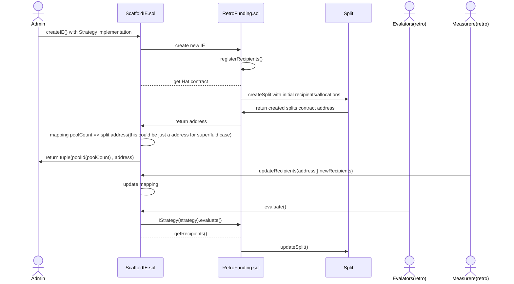

## TL;DR

Scaffold smartcontract to setup IE. Or you can say "MVIE"

<!--  -->

- [ ] Who determin the distribution between IEs and how
- [ ] What kind of AccessControl roles we need for strategy
- [ ] TODO: add attestation(\_beforeEvaluation) flow on sequenceDiagram

