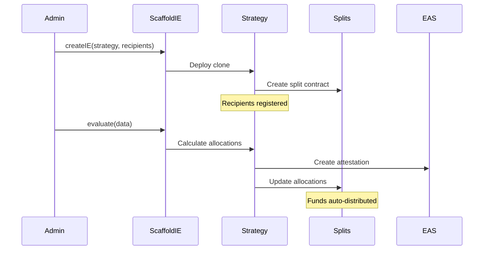
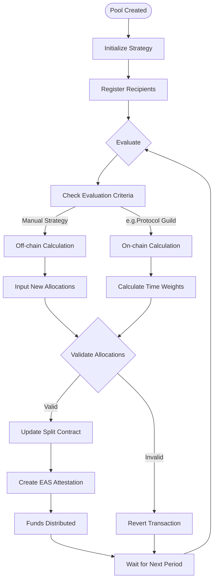

# ScaffoldIE

## Overview

ScaffoldIE is a smart contract scaffold that how we conduct Impact Evaluations (IE). Built during the Impact Evaluation Research Retreat (IERR) 2025, it implements a two-layer distribution architecture that enables both portfolio-level and project-level evaluation, addressing automated mechanisms to distribute funds based on post-measurement.

### Deployed Contracts (Sepolia)

- **Root Split Example**: [View on 0xSplits](https://app.splits.org/accounts/0x159F16726970a8E2067318A1bD0177029C0886A3/?chainId=11155111) - showing 4 IE pools with different allocations
- **ScaffoldIE**: [`0x31f0d35410f95aFAF29864c6dbd23Adfc8D28dfC`](https://sepolia.etherscan.io/address/0x31f0d35410f95aFAF29864c6dbd23Adfc8D28dfC)
- **RetroFundingManual strategy implementation**: [`0x96dD5187e48e4C116202BFD0001936814e68fF3F`](https://sepolia.etherscan.io/address/0x96dD5187e48e4C116202BFD0001936814e68fF3F)
- **ProtocolGuild strategy implementation**: [`0xfae2FD69e301d28CB03634AA958dC9ae1d041dcb`](https://sepolia.etherscan.io/address/0xfae2FD69e301d28CB03634AA958dC9ae1d041dcb)

### Core Architecture

#### Modular Strategy Pattern

ScaffoldIE implements a gas-efficient cloneable strategy pattern where different evaluation mechanisms can be plugged in:

```
ScaffoldIE (Orchestrator)
    ├── RetroFundingManual (Manual calculation)
    ├── ProtocolGuild (Time-weighted allocations)
    └── [Your Custom Strategy]
```

#### Two-Layer Distribution Architecture

ScaffoldIE implements a sophisticated two-layer fund distribution system:

```
Treasury/Funding Source
         |
         v
   Root Split (0x159F16726970a8E2067318A1bD0177029C0886A3)
         |
    [Evaluator adjusts weights]
         |
    +--------+--------+--------+
    |        |        |        |
   10%      20%      30%      40%
    |        |        |        |
    v        v        v        v
 Pool 0   Pool 1   Pool 2   Pool 3
    |        |        |        |
    v        v        v        v
Recipients Recipients Recipients Recipients
(Splits)  (Splits)  (Splits)  (Splits)
```


**Layer 1: Root Distribution**

- ScaffoldIE acts as the root split controller
- Evaluators at this level can adjust weights between different IE pools
- Enables portfolio-level impact allocation

**Layer 2: IE-Specific Distribution**

- Each IE pool has its own distribution mechanism
- Currently uses 0xSplits, but designed for future integrations (Drips, Superfluid)
- Independent evaluator access control per IE pool

This architecture enables:

- **Hierarchical Distribution**: Different evaluators for portfolio vs. project level
- **Protocol Flexibility**: Each IE can use different distribution protocols
- **Dynamic Rebalancing**: Adjust funding priorities without disrupting individual projects
- **Scalability**: Add new IE pools without modifying existing ones

#### Key Components

1. **ScaffoldIE.sol** - Main orchestrator managing pool creation, evaluation routing, and root split control
2. **BaseIEStrategy.sol** - Abstract base providing hooks for custom evaluation logic
3. **Strategy Implementations**:
   - **RetroFundingManual**: Inspired by [Optimism](https://optimism.io) and [Filecoin](https://filecoin.io) retroactive funding models
   - **ProtocolGuild**: Based on [Protocol Guild](https://protocolguild.org) and implements Protocol Labs' [Generalized Impact Evaluator](https://research.protocol.ai/publications/generalized-impact-evaluators/ngwhitepaper2.pdf) concept as a minimal on-chain IE mechanism
4. **Distribution Layers**:
   - **Root Split**: Managed by ScaffoldIE for portfolio-level allocation
   - **IE Splits**: Individual distribution mechanisms per evaluation pool

#### Protocol Integrations

- **EAS (Ethereum Attestation Service)**: Scaffold IE is designed to align with hypercerts protocol v2 architecture
- **0xSplits Protocol**: Current implementation for automated fund distribution
- **Future Integrations**: Architecture supports [Drips](https://drips.network), [Superfluid](https://superfluid.finance), and other distribution protocols at the IE level

### How It Works




### Iteration Flow Diagram




#### Two-Layer Distribution Example

```solidity
// Layer 2: Create multiple IE pools with different strategies
scaffoldIE.createIE(retroData, initData, retroFundingStrategy); // Pool 0
scaffoldIE.createIE(guildData, initData, protocolGuildStrategy); // Pool 1

// Layer 1: Create root split distributing between IE pools
uint32[] allocations = [600000, 400000]; // 60% to Pool 0, 40% to Pool 1
scaffoldIE.createIERoute(allocations);

// Layer 1 Evaluation: Root evaluator can adjust IE pool weights
scaffoldIE.updateRoute([700000, 300000]); // Rebalance to 70/30

// Layer 2 Evaluation: Each IE has independent evaluators
scaffoldIE.evaluate(0, retroAllocations, retroEvaluator); // Pool 0 evaluation
scaffoldIE.evaluate(1, guildData, guildEvaluator); // Pool 1 evaluation

// Each layer has independent evaluation criteria
```

#### Scenario 1: Retroactive Funding

Creating a retroactive funding pool with off-chain measurement/evaluation:

```solidity
// Register contributors
address[] recipients = [alice, bob, charlie];
uint32[] allocations = [400000, 350000, 250000]; // 40%, 35%, 25%

// Create evaluation pool
scaffoldIE.createIE(data, initData, retroFundingStrategy);

// IE-specific evaluator updates distribution
scaffoldIE.evaluate(poolId, allocations, evaluator);
```

- Require offchain computation of each weights
- Possibly integrate GitHub Actions that triger evaluate function with evaluator role

#### Scenario 2: Protocol Guild

Time-weighted allocation inspired by [protocolguild.org](https://protocolguild.org):

```solidity
// Register with work types
WorkType[] types = [FULL_TIME, PART_TIME, FULL_TIME];

// Automatic calculation implementing minimal IE mechanism
// Alice (6 months full-time): sqrt(180 days) × 10 = 134.16
// Bob (6 months part-time): sqrt(180 days) × 5 = 67.08
// Charlie (3 months full-time): sqrt(90 days) × 10 = 94.87

// IE evaluator triggers recalculation
scaffoldIE.evaluate(guildPoolId, evalData, guildEvaluator);

// This pool receives funds based on root split allocation
```

### Time Weight Formula (Protocol Guild Implementation)

The time weight for each contributor is calculated using the following formula:

#### Individual Time Weight

For contributor $i$ at evaluation time $t$:
$w_i(t) = \sqrt{(d_i^{eval} - d_i^{start}) \cdot f_i}$

Where:

- $w_i(t)$ = time weight for contributor $i$ at time $t$
- $d_i^{eval}$ = evaluation timestamp (in days)
- $d_i^{start}$ = start date timestamp (in days) for contributor $i$
- $(d_i^{eval} - d_i^{start})$ = active contribution period
- $f_i$ = full/part-time multiplier for contributor $i$

#### Full/Part-time Multiplier

In our implementation:
$f_i = \begin{cases}
10 & \text{if full-time (FULL)} \\
5 & \text{if part-time (PARTIAL)}
\end{cases}$

#### Normalized Share Calculation

The final allocation percentage for contributor $i$:
$s_i(t) = \frac{w_i(t)}{\sum_{j=1}^{n} w_j(t)} \times 1,000,000$

Where $n$ is the total number of contributors, and results are in basis points (1,000,000 = 100%).

The total weight across all contributors:
$W_{total}(t) = \sum_{i=1}^{n} w_i(t) = \sum_{i=1}^{n} \sqrt{(d_i^{eval} - d_i^{start}) \cdot f_i}$

The final allocation calculation using sigma notation:
$s_i(t) = \frac{\sqrt{(d_i^{eval} - d_i^{start}) \cdot f_i}}{\sum_{j=1}^{n} \sqrt{(d_j^{eval} - d_j^{start}) \cdot f_j}} \times 1,000,000$

**Note**: Unlike the original Protocol Guild formula, our implementation uses:

- Active time calculation: `evaluation timestamp - start timestamp`
- Time units in days rather than months
- Using basis points (1,000,000) to adjust uint32
