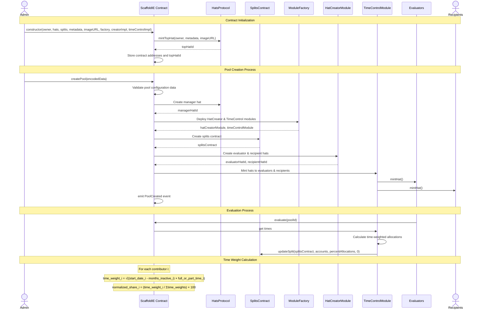

## TL;DR

Scaffold smartcontract to setup IE. Or you can say "MVIE"


## Use cases

### e.g. Protocol Guild style IE


```
ImpactEvaluator {
 foreach round(4m) {
   claims = "Contributions to Ethereum developments"
   metrics = measure(time, full_or_part_time)
   weight = calculateTimeWeight()
   rewards = split(weight)
 }
}
```

#### Time Weight Formula

The time weight for each contributor is calculated using the following formula:

#### Individual Time Weight

For contributor $i$ at evaluation round $t$:

$$w_i(t) = \sqrt{(d_i^{start} - d_i^{inactive}) \cdot f_i}$$

Where:

- $w_i(t)$ = time weight for contributor $i$ at time $t$
- $d_i^{start}$ = start date (in months) for contributor $i$
- $d_i^{inactive}$ = months inactive for contributor $i$
- $f_i$ = full/part-time multiplier for contributor $i$

### Full/Part-time Multiplier

$$
f_i = \begin{cases}
1.0 & \text{if full-time } \\
0.5 & \text{if part-time }
\end{cases}
$$

### Normalized Share Calculation

The final share percentage for contributor $i$:

$$s_i(t) = \frac{w_i(t)}{\sum_{j=1}^{n} w_j(t)} \times 100$$

Where $n$ is the total number of contributors.

The total weight across all contributors:

$$W_{total}(t) = \sum_{i=1}^{n} w_i(t) = \sum_{i=1}^{n} \sqrt{(d_i^{start} - d_i^{inactive}) \cdot f_i}$$

The final share calculation using sigma notation:

$$s_i(t) = \frac{\sqrt{(d_i^{start} - d_i^{inactive}) \cdot f_i}}{\sum_{j=1}^{n} \sqrt{(d_j^{start} - d_j^{inactive}) \cdot f_j}} \times 100$$

---

> Each member’s share of the split contract is calculated using member-specific inputs. There are two parts to the calculation:
> Calculate each member’s time*weight: time_weight = SQRT((start_date - months_inactive) * full*or_part_time)
> Normalize time_weight as a percentage: split_share = (time_weight / total_time_weights) * 100
> This formulation recognizes the local knowledge contributors gain over time, and uses that as a proxy for “value to the commons” and to allocate funding to members. Existing contributor weights get “diluted” as newcomers show up. Continuing contributors get additional weight per month they are active.
> Each member’s time-weight is updated onchain every quarter along with an Ethereum address they control to allocate the funding flowing through the mechanism.



## Hypercerts Usecase

```solidity
    function getWearerStatus(
        address _wearer,
        uint256 /*_hatId */
    ) public view override returns (bool eligible, bool standing) {
        uint256 len = ARRAY_LENGTH();
        IHypercertToken token = IHypercertToken(TOKEN_ADDRESS());
        uint256[] memory tokenIds = TOKEN_IDS();
        uint256[] memory minBalances = MIN_BALANCES_OF_UNITS();

        for (uint256 i = 0; i < len; ) {
            eligible = token.unitsOf(_wearer, tokenIds[i]) >= minBalances[i];
            if (eligible) break;
            unchecked {
                ++i;
            }
        }
        standing = true;
    }
```








