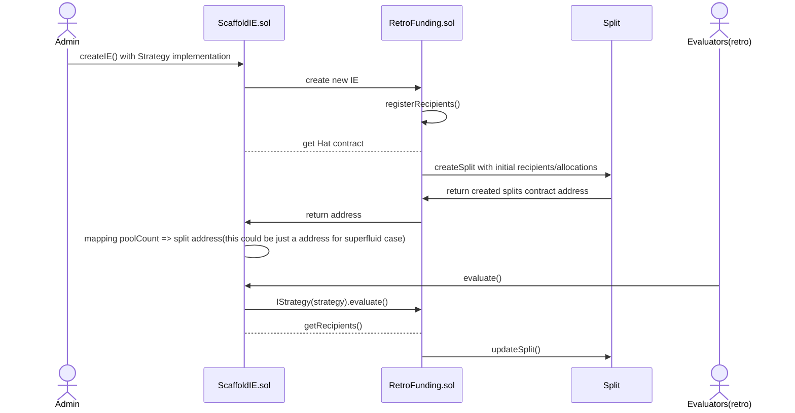

# Core Contract

## Core Architecture

ScaffoldIE implements a gas-efficient cloneable strategy pattern where different evaluation mechanisms can be plugged in:

```
ScaffoldIE (Orchestrator)
    ├── RetroFundingManual (Manual calculation)
    ├── ProtocolGuild (Time-weighted allocations)
    └── [Your Custom Strategy]
```

- Deploy strategy logic once, clone for multiple evaluation pools
- Significant gas savings (up to 90% reduction in deployment costs)
- Consistent logic with independent state management


